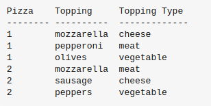

# BCNF, or Boyce-Codd Normal Form

`BCNF`, or Boyce-Codd Normal Form, is a design principle used in database normalization to `eliminate redundancy and dependency anomalies`.

Your pizza can have exactly three topping types:

- one type of cheese
- one type of meat
- one type of vegetable

So we order two pizzas and choose the following toppings:

The subtle difference is that `3NF` makes a distinction between key and non-key attributes (also called non-prime attributes) whereas `BCNF` does not.

**Example:**

The standard example is the following relational schema:

- Header: R(A, B, C)
- Functional dependencies: AB->C and C->B.

In this case we can derive that the candidate keys are `AB` and `AC`. So this relational schema is in `3NF` (since all columns are prime, i.e., `part of a candidate key`) but not in `BCNF` (since C->B does not logically follow from the candidate keys, as C is not a superset of a candidate key).

The properties followed by BCNF in DBMS are as-

1. It should already follow the properties of 3NF
2. For a functional dependency, `A->B`, `A` must be a super key or candidate key.